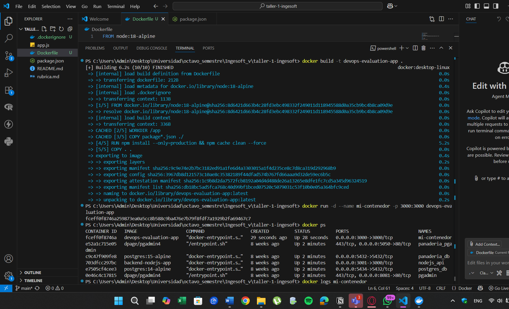
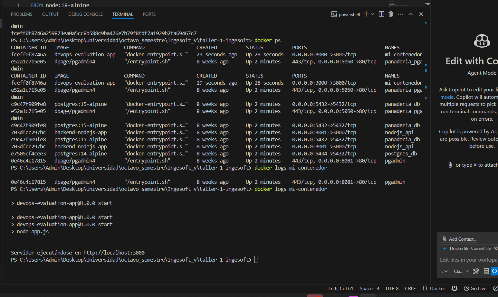
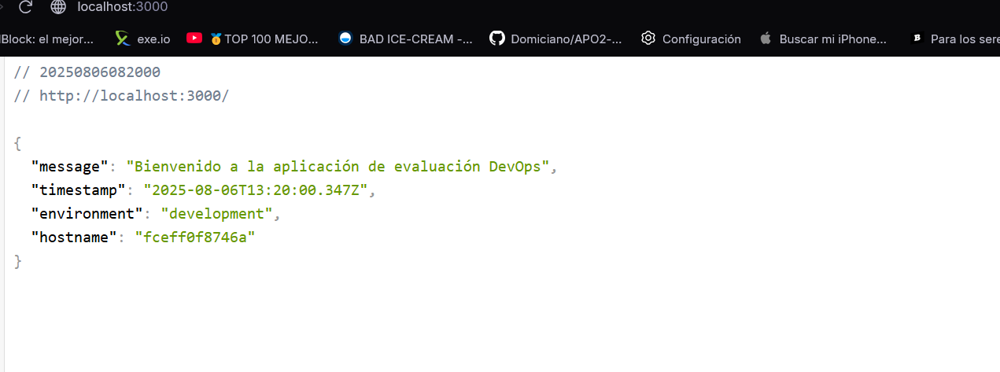

# ArquitecturaSFV-P1

# Evaluación Práctica - Ingeniería de Software V

## Información del Estudiante
- **Nombre:** Juan David Calderón
- **Código:** A00395803
- **Fecha:** Agosto 2025

## Resumen de la Solución
Implementación de una aplicación Node.js sencilla utilizando Docker para containerización. La aplicación corre en el puerto 3000 y utiliza una imagen base Alpine para optimizar el tamaño del contenedor.

## Dockerfile
```dockerfile
FROM node:18-alpine

WORKDIR /app

COPY package*.json ./
RUN npm install --only=production && npm cache clean --force

COPY . .

EXPOSE 3000

CMD ["npm", "start"]
```

**Decisiones tomadas:**
- **node:18-alpine**: Imagen base ligera que reduce el tamaño del contenedor
- **npm install --only=production**: Instala solo dependencias de producción para optimizar espacio
- **npm cache clean --force**: Limpia la cache de npm para reducir el tamaño de la imagen
- **EXPOSE 3000**: Documenta el puerto que usa la aplicación

## Comandos Ejecutados
docker build -t devops-evaluation-app .
docker run -d --name mi-contenedor -p 3000:3000 devops-evaluation-app
docker ps
docker logs mi-contenedor


## Principios DevOps Aplicados
1. **Containerización**: Uso de Docker para garantizar consistencia entre entornos
2. **Optimización de recursos**: Uso de imagen Alpine y limpieza de cache
3. **Automatización**: Proceso de build y deployment automatizado con Docker

## Captura de Pantalla







- Proceso de build del contenedor exitoso
- Aplicación corriendo en el puerto 3000
- Múltiples contenedores ejecutándose correctamente
- Logs de la aplicación mostrando "Servidor ejecutándose en http://localhost:3000"

## Instrucciones para Ejecutar
1. Clonar el repositorio
2. Navegar al directorio del proyecto
3. Ejecutar: `docker build -t devops-evaluation-app .`
4. Ejecutar: `docker run -d --name mi-contenedor -p 3000:3000 devops-evaluation-app`
5. Abrir navegador en `http://localhost:3000`

## Mejoras Futuras
1. Implementar CI/CD pipeline con GitHub Actions o similar


